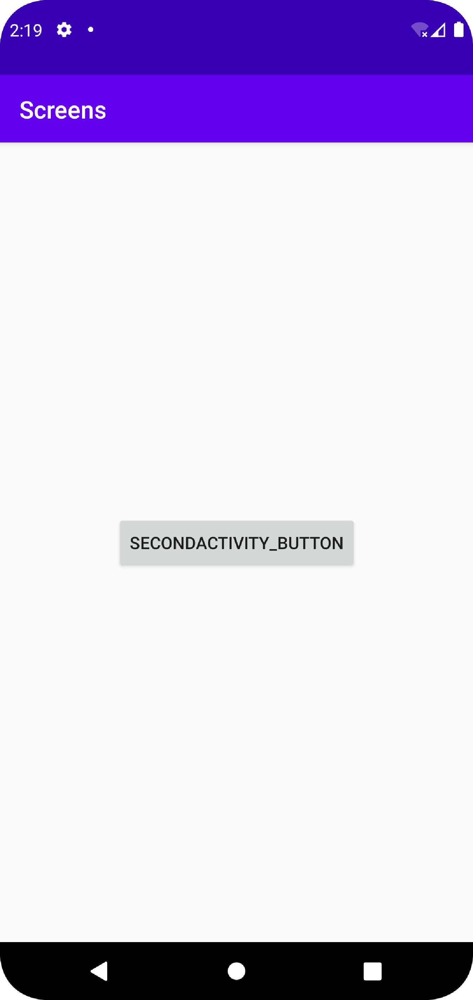
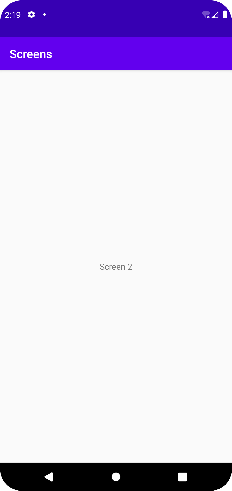

# Rapport

Gjorde en SecondActivity klass som ändrar en TextView till att visa ett namn och ett nummer från extras i dess Intent.
```
package com.example.screens;

import androidx.appcompat.app.AppCompatActivity;

import android.os.Bundle;
import android.widget.TextView;

public class SecondActivity extends AppCompatActivity {

    private TextView textView;

    @Override
    protected void onCreate(Bundle savedInstanceState) {
        super.onCreate(savedInstanceState);
        setContentView(R.layout.activity_second);

        Bundle extras = getIntent().getExtras();
        if (extras != null) {
            String name = extras.getString("name");
            int number = extras.getInt("number");
            textView = findViewById(R.id.extras_text);
            textView.setText(name +" " + number);
        }
    }
}
```

SecondActivity lades till i AndroidManifest.xml.
```
        <activity
            android:name=".SecondActivity"
            android:exported="false" />
```

activity_second.xml som har en tom TextView i mitten av skärmen för SecondActivity.
```
<?xml version="1.0" encoding="utf-8"?>
<androidx.constraintlayout.widget.ConstraintLayout xmlns:android="http://schemas.android.com/apk/res/android"
    xmlns:app="http://schemas.android.com/apk/res-auto"
    xmlns:tools="http://schemas.android.com/tools"
    android:layout_width="match_parent"
    android:layout_height="match_parent"
    tools:context=".SecondActivity">

    <TextView
        android:id="@+id/extras_text"
        android:layout_width="wrap_content"
        android:layout_height="wrap_content"
        android:text=""
        app:layout_constraintBottom_toBottomOf="parent"
        app:layout_constraintLeft_toLeftOf="parent"
        app:layout_constraintRight_toRightOf="parent"
        app:layout_constraintTop_toTopOf="parent" />

</androidx.constraintlayout.widget.ConstraintLayout>
```

Button med button som har button som ID och "SecondActivity_button" som text.
```
    <Button
        android:id="@+id/button"
        android:layout_width="wrap_content"
        android:layout_height="wrap_content"
        android:text="SecondActivity_button"
        app:layout_constraintBottom_toBottomOf="parent"
        app:layout_constraintLeft_toLeftOf="parent"
        app:layout_constraintRight_toRightOf="parent"
        app:layout_constraintTop_toTopOf="parent" />
```

En "switchActivity" Button kopplad till "button" som startar en SecondActivity och skickar med namnet "Screen" samt numret 2.
```
    private Button switchActivity;

    @Override
    protected void onCreate(Bundle savedInstanceState) {
        super.onCreate(savedInstanceState);
        setContentView(R.layout.activity_main);

        switchActivity = findViewById(R.id.button);
        switchActivity.setOnClickListener(new View.OnClickListener() {
            @Override
            public void onClick(View view) {
                Intent intent = new Intent(MainActivity.this, SecondActivity.class);
                intent.putExtra("name", "Screen");
                intent.putExtra("number", 2);
                startActivity(intent);
            }
        });
    }
```

Screenshot av MainActivity

Screenshot av SecondActivity

